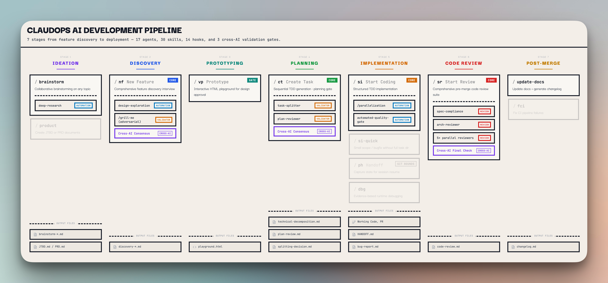

# claudops

> Universal Claude Code workflow template — clone, run `/setup`, start building

**Author:** [@alexandrbasis](https://x.com/alexandrbasis) | [@MishkaKey](https://x.com/MishkaKey)

[](https://alexandrbasis.com/claudops/workflows/)

<a href="https://alexandrbasis.com/claudops/workflows/">
  
</a>

---

A production-tested `.claude/` folder you drop into **any** codebase. Includes agents, skills, hooks, and a setup wizard that auto-configures everything to match your tech stack.

Works with any language, framework, and architecture — TypeScript, Python, Go, Ruby, Java, and more.

## Philosophy

This is a **human-in-the-loop pipeline**, not a fully autonomous agent. Every stage is triggered by you, every output is validated by you. The AI proposes — you approve, adjust, or reject. Nothing ships without your explicit sign-off.

- **You trigger** each stage — `/nf` for discovery, `/ct` for planning, `/si` for implementation, `/sr` for review
- **You validate** between stages — review the discovery doc before planning, review the plan before coding
- **You control the gates** — quality checks run automatically, but merging is always your decision
- **Agents assist, not replace** — 17 agents handle the grunt work (linting, testing, architecture checks), you make the calls

The result: AI speed with human judgment. Full context at every step, no black-box automation.

## Highlights

- **`/setup` wizard** — auto-detects your tech stack, project structure, and commands, then configures all skills, agents, and hooks in one pass
- **`/update-setup`** — pulls upstream changes from claudops, shows a diff, lets you cherry-pick updates while preserving your local customizations
- **17 specialized agents** — TDD, code review, task validation, research
- **31 skills** — full dev lifecycle, dev server monitoring, and cross-AI helpers (Gemini CLI, Codex CLI, Cursor CLI)
- **Skills ↔ Agents composability** — agents preload shared convention skills via `skills:` frontmatter
- **Cross-AI plan review** — optional Gemini verification of plans (see `review-plan-gemini.sh`)
- **Hooks** — lint on write, sync, validation, guards, metrics
- **Linear integration** — project management from your terminal (`cc-linear` skill)

---

## What's Inside

### Agents (17)

**Automation** (`.claude/agents/automation-agents/`)
| Agent | Purpose |
|-------|---------|
| `automated-quality-gate` | Runs lint, types, tests before review |
| `developer-agent` | Universal agent for scoped work items |
| `integration-test-runner` | E2E and integration test execution |
| `senior-architecture-reviewer` | Reviews approach, architecture, TDD compliance |

**Code review** (`.claude/agents/code-review-agents/`)
| Agent | Focus |
|-------|-------|
| `code-quality-reviewer` | SOLID, maintainability, code smells |
| `documentation-accuracy-reviewer` | Docs completeness and accuracy |
| `performance-reviewer` | N+1 queries, caching, optimization |
| `security-code-reviewer` | OWASP Top 10, injection, auth issues |
| `spec-compliance-reviewer` | Spec and requirements alignment |
| `test-coverage-reviewer` | Coverage gaps, test quality |

**Task validators** (`.claude/agents/tasks-validators-agents/`)
| Agent | Purpose |
|-------|---------|
| `plan-reviewer` | Technical plan validation |
| `task-splitter` | Evaluates if a task needs breakdown |
| `task-decomposer` | Phase structure for split tasks |

**Workflow** (`.claude/agents/wf-agents/`)
| Agent | Purpose |
|-------|---------|
| `changelog-generator` | Changelog from task docs |
| `create-pr-agent` | PR automation with Linear integration |
| `docs-updater` | Documentation synchronization |

**Helpers** (`.claude/agents/helpful-agents/`)
| Agent | Purpose |
|-------|---------|
| `comprehensive-researcher` | In-depth research tasks |

---

### Skills (31)

See [`.claude/skills/README.md`](.claude/skills/README.md) for the full index. Summary:

| Area | Examples |
|------|----------|
| Setup & conventions | `setup`, `update-setup`, `coding-conventions`, `review-conventions` |
| Core workflow | `ct`, `si`, `si-quick`, `sr`, `prc`, `ph`, `nf`, `product`, `vp`, `blueprint` |
| Discovery & design | `brainstorm`, `design-exploration`, `analyze`, `grill-me`, `rip` |
| Quality & debugging | `dev-server`, `code-analysis`, `dbg`, `fci` |
| Cross-AI | `gemini-cli`, `codex-cli`, `cursor-cli` |
| Integrations & meta | `cc-linear`, `deep-research`, `parallelization`, `sbs`, `update-docs` |

---

### Skills ↔ Agents Composability

Review agents and the developer agent preload shared convention skills via `skills:` frontmatter — no per-agent duplication:

```yaml
# In agent frontmatter
skills:
  - review-conventions   # preloaded into all 7 review agents
  - coding-conventions   # preloaded into developer-agent
```

The `/setup` wizard fills these convention skills with your project's tech stack, architecture rules, and commands. Every agent inherits them automatically.

---

### Cross-AI plan review

Optional flow when Gemini CLI is configured — see `.claude/scripts/review-plan-gemini.sh` and hook wiring in `.claude/settings.json`.

**What Gemini can check:** security, architecture, performance, edge cases, testability.

---

### Hooks

Python/shell hooks under `.claude/hooks/` — lint on write, agent sync, pre-commit checks, bash/file guards, cost tracking, etc. Details: [`.claude/hooks/README.md`](.claude/hooks/README.md).

---

## Repository structure

```
.claude/
├── agents/           # Specialized subagents
├── docs/
│   ├── templates/    # PRD, JTBD, decomposition, review templates
│   └── references/
├── hooks/            # Claude Code hooks (see hooks/README.md)
├── scripts/          # e.g. review-plan-gemini.sh, linear-api.sh
├── skills/           # Slash-command skills (see skills/README.md)
└── settings.json     # Hook and project settings (copy & customize)

workflow-visualization.html   # Interactive workflow map (open in browser)
```

---

## Quick Start

### 1. Clone into your project
```bash
git clone https://github.com/alexandrbasis/claudops.git
cp -r claudops/.claude your-project/
cd your-project
```

### 2. Run the setup wizard
```
/setup
```

The wizard will:
1. **Scan your codebase** with 3 parallel agents (tech stack, project structure, commands)
2. **Confirm** detected values with you (framework, ORM, test/lint/build commands, architecture)
3. **Fill in** all `{{PLACEHOLDER}}` variables directly in every skill, agent, and hook file

After setup, every file has your real values baked in — no runtime resolution, no config indirection.

### 3. Keep it updated
```
/update-setup
```

Pulls latest changes from the upstream claudops repo, shows what's new or modified, and lets you cherry-pick what to apply. Your custom local skills and hooks are never touched.

### 4. Start using workflows
```
/ct    — create a technical decomposition
/si    — start implementation from a task
/sr    — run multi-agent code review
```

### Cherry-pick individual skills
```bash
cp -r claudops/.claude/skills/si your-project/.claude/skills/
cp claudops/.claude/scripts/review-plan-gemini.sh your-project/.claude/scripts/
```

### As reference
Study the patterns and adapt them to your own workflows.

---

## Key workflows

### TDD pipeline
```
/ct → /si → automated-quality-gate → senior-architecture-reviewer
```

### Multi-agent code review
```
code-quality + security + performance + test-coverage + documentation
```

### Task-driven flow
```
/ct → /si → /sr → /prc → merge
```

### Cross-AI
- Gemini CLI — plan review, web-grounded research
- Codex / Cursor CLI — second-opinion review (see `cross-ai-protocol` template)

---

## Prerequisites

- [Claude Code](https://docs.anthropic.com/en/docs/claude-code) installed
- Git + GitHub CLI (`gh`)
- Optional: Gemini CLI (`npm i -g @google/gemini-cli`)
- Optional: Linear API access

---

## Security & privacy

**Not included (sensitive):** `settings.local.json`, API keys, MCP credentials, log files

**Safe to share:** Agents, skills, hook scripts, and templates in this repo (exclude local overrides)

---

## Contributing

Found a better pattern? Have suggestions?
- Open an issue with your idea
- Share your own workflows
- Contribute improvements via PR

---

## License

MIT — See [LICENSE](LICENSE)
